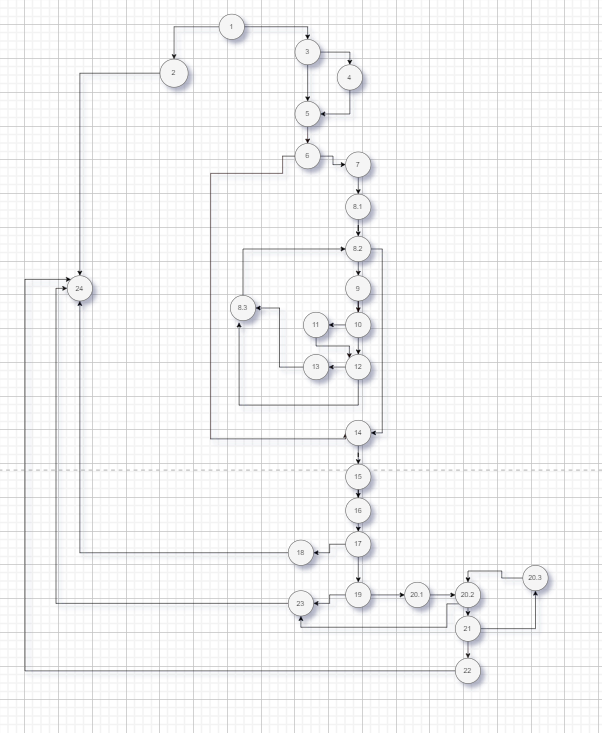
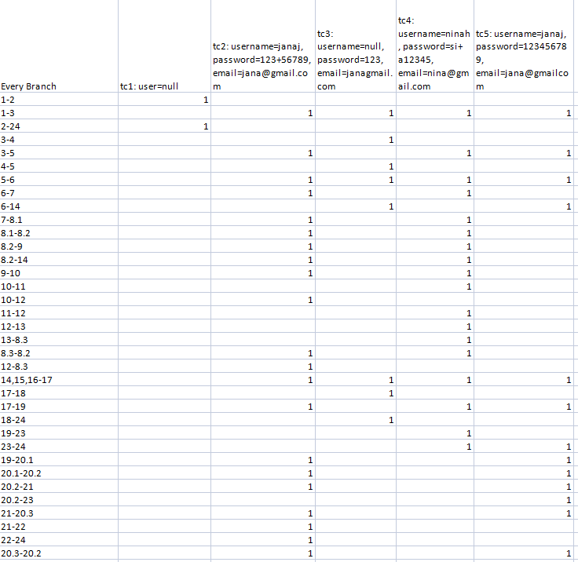
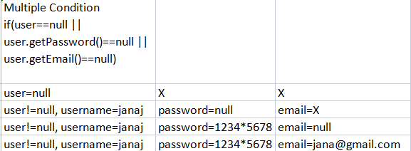

Јана Јовчевска, 213002

Control Flow Graph 

Цикломатската комплексност на овој код е 11 и истата ја добив со броење на рагионите од Control Flow Graph-от, и ја потврдив со формулата за предикатни јазли+1.

Тест случаи според критериумот Every Branch

-> Во сите тест случаи, листата на корисници (List<User> allUsers) вклучува два корисници и тоа со: username - markoA, password - skopje123!, email - mantovski@gmail.com и вториот корисник со username - ninah, password - sifinki?55, email - nina@gmail.com
  
-> Во првиот тест случај user==null, затоа се фрла exception.
  
-> Во вториот тест случај username e janaj, password е 123+56789 (подолг е од 8 карактери, не го содржи username-от и нема празно место, содржи специјален знак), email е jana@gmail.com (коректен еmail што содржи "@" и ".", но не се совпаѓа со ниеден од листата на постоечки корисници), ќе се врати true
  
-> Во третиот тест случај username е null (ќе се стави email како username), password е 123 (краток, <8 карактери), email janagmail.com (не содржи "@"), ќе се врати false
                                                                                                        
-> Во четвртиот тест случај username e ninah, password е si+ a12345 (подолг е од 8 карактери, не го содржи username-от, содржи празно место), email е nina@gmail.com, се тестира случај кога имаме ист username и email со веќе постоечки корисник, ќе се врати false
  
-> Во петтиот тест случај username е јаnај, password е 123456789 (подолг е од 8 карактери, не го содржи username-от и нема празно место, не содржи специјален знак), email е jana@gmailcom (не содржи "."), ќе се врати false

Tест случаи според критериумот Multiple Condition

-> Во првиот тест случај првиот услов (user==null) ќе се исполни и ќе се фрли exception, не се важни останатите два

-> Во вториот тест случај вториот услов (user.getPassword()==null) ќе се ислполни и повторни ќе се фрли exception,
при што не е важен третиот услов, а првиот нема да биде точен

-> Во третиот тест случај третиот услов (user.getEmail()==null) ќе се исполни и ќе се фрли exception, а претходните два ќе бидат неточни

-> Во четвртиот и последен тест случај ниеден од условите нема да се исполни и нема да се фрли exception, ќе продолжи да се извршува кодот

